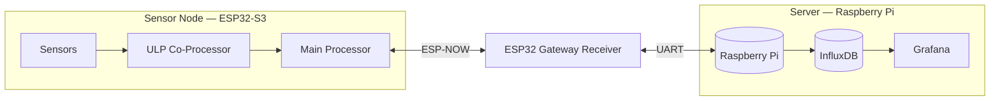

# IoT Weather Station

An ultra-low-power, solar-capable weather station built around an **ESP32-S3 sensor node**, an **ESP32 ESP-NOW gateway**, and a **Raspberry Pi** running InfluxDB + Grafana.

It measures **temperature, humidity, pressure, rainfall, wind speed and wind direction**, and streams the data to a live Grafana dashboard.

## Architecture



A more detailed breakdown of each block is in [docs/architecture.md](docs/architecture.md).

## How it works

1. **ESP32-S3 sensor node** ([firmware/sensor-node](firmware/sensor-node)) — the ULP co-processor stays alive during deep sleep, counting rain and wind pulses, and wakes the main core only when needed. The main core reads the full sensor suite (BME280, anemometer, wind vane, rain gauge) and transmits a compact reading over ESP-NOW before going back to sleep.
2. **ESP32 gateway receiver** ([firmware/gateway-receiver](firmware/gateway-receiver)) — always-on, listens for ESP-NOW packets from the sensor node and forwards each reading as a JSON line over UART.
3. **Raspberry Pi** ([raspberry-pi](raspberry-pi)) — `serial_listener.py` reads the UART stream and writes each reading to InfluxDB; Grafana visualizes the resulting time series.

## Repository structure

```
iot-sensor-network/
├── docs/                 # Architecture docs, diagrams, setup guide
├── firmware/
│   ├── sensor-node/      # ESP32-S3 firmware (main + ULP)
│   └── gateway-receiver/ # ESP32 ESP-NOW -> UART gateway firmware
├── raspberry-pi/         # InfluxDB + Grafana stack and ingestion scripts
└── hardware/             # Bill of materials and wiring notes
```

## Getting started

See [docs/setup.md](docs/setup.md) for full build, flash, and deployment instructions.

## Hardware

Bill of materials and wiring notes: [hardware/bom.md](hardware/bom.md)

## License

MIT — see [LICENSE](LICENSE).
