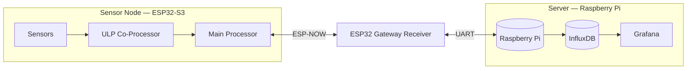

# Architecture

_Source: [architecture.mmd](architecture.mmd)_

## ESP32-S3 sensor node

### ULP co-processor

The RISC-V ULP co-processor stays active while the main CPU is in deep sleep
(a few µA). It polls the rain gauge and anemometer pulse pins directly via
`ulp_riscv_gpio_get_level()` and counts edges in
[`firmware/sensor-node/main/ulp/ulp_main.c`](../firmware/sensor-node/main/ulp/ulp_main.c).
Once a configurable pulse threshold is reached, it calls
`ulp_riscv_wakeup_main_processor()` to bring up the main core.

### Main processor

On wake (either the ULP threshold or a periodic timer), the main core:

1. Initializes the I2C/ADC sensor drivers (`sensors.c`).
2. Takes one reading from every sensor (temperature, humidity, pressure,
   rain, wind speed, wind direction, battery voltage).
3. Brings up Wi-Fi + ESP-NOW just long enough to send the reading to the
   gateway (`espnow_tx.c`).
4. Tears everything down and goes back to deep sleep.

This keeps radio-on time to a few milliseconds per cycle, which is the
dominant power draw on the sensor node.

## ESP32 gateway receiver

The gateway is mains-powered and stays on continuously. It:

1. Brings up Wi-Fi in station mode and registers an ESP-NOW receive
   callback (`espnow_rx.c`).
2. On each incoming packet, validates the payload size and re-serializes
   the reading as a single JSON line.
3. Writes that line to a UART connected to the Raspberry Pi
   (`uart_forward.c`).

## Raspberry Pi

`raspberry-pi/src/serial_listener.py` reads JSON lines from the UART,
parses them, and hands each reading to `db_writer.py`, which writes a point
to InfluxDB. Grafana (provisioned via `docker-compose.yml`) queries InfluxDB
to render the live dashboard.

## Data format

Every reading sent over ESP-NOW is a packed C struct (`sensor_data_t`,
defined in
[`firmware/sensor-node/main/sensors.h`](../firmware/sensor-node/main/sensors.h)
and mirrored in
[`firmware/gateway-receiver/main/espnow_rx.h`](../firmware/gateway-receiver/main/espnow_rx.h)):

| Field | Type | Unit |
|---|---|---|
| `temperature_c` | float | °C |
| `humidity_pct` | float | % |
| `pressure_hpa` | float | hPa |
| `rain_mm` | float | mm |
| `wind_speed_ms` | float | m/s |
| `wind_direction_deg` | float | ° |
| `battery_v` | float | V |

The gateway re-serializes this struct as a single JSON line over UART. Each
key above becomes a field on the `weather` measurement in InfluxDB.
